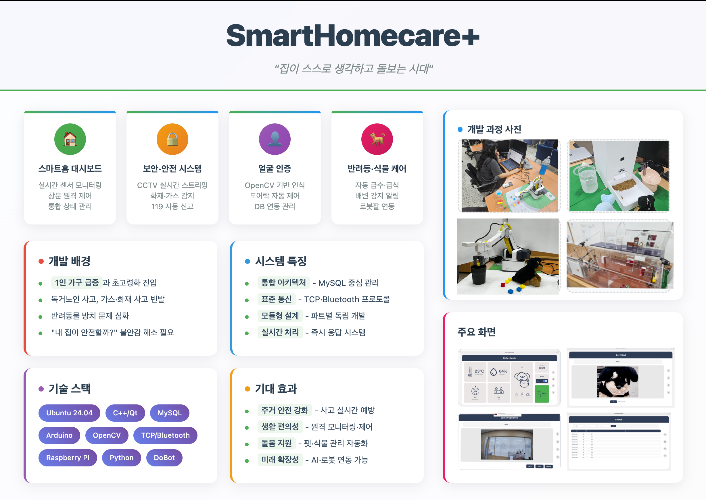

# 🏠 스마트홈 통합관리 프로젝트

IoT 기술을 활용한 **스마트홈 통합 관리 시스템**으로, 센서 모니터링, 얼굴 인증, CCTV, 반려동물·식물 관리, TCP 서버/클라이언트 통신 및 MySQL 데이터베이스 관리를 통합하여 구현한 팀 프로젝트입니다.
본 프로젝트는 **광주인력개발원** 훈련 과정 팀 프로젝트로 진행되었습니다.

---

## 📌 프로젝트 개요
- **프로젝트명**: 스마트홈 통합관리  
- **인원**: 12명
- **진행 기간**: 2025/08/26 ~ 2025/09/19  
- **장소**: 광주인력개발원 공학 1관 드론융합실  
- **개발 목적**:  
  1인 가구 증가와 고령화에 따른 **주거 환경 스마트화**를 위해 IoT 기술을 활용한 통합 스마트홈 시스템 개발  

---

## ⚙️ 개발 환경
- **운영체제 (OS)**: Ubuntu  
- **프로그래밍 언어**: C++, Python  
- **프레임워크**: Qt  
- **DB**: MySQL  
- **개발 도구 (IDE)**: Qt Creator, VS Code, Arduino sketch  

---

## 🚀 구현 기능

### 1. 스마트홈 대시보드
- 메인 UI 표시, 실시간 센서 데이터 모니터링  
- 온도/습도 카드, 화재/가스 상태, 식물 습도, 반려동물 상태 표시  
- 창문 제어 시스템 (토글 스위치)  
- 시계 및 날짜 표시  
- 페이지 네비게이션 (Safety/Certified/Search)  
- TCP 클라이언트를 통한 서버 통신  

### 2. 보안/안전 관리
- 실시간 카메라 모니터링 (ON/OFF 제어, 라이브 영상 스트리밍)  
- 화재경보 시스템 (알림, 경보 중지, 상태 배너)  
- 119 신고 시스템 (긴급 신고, 통화 종료, 진행 상태 표시)  

### 3. 얼굴 인증 시스템
- OpenCV 기반 얼굴 검출 및 등록  
- 얼굴 이미지 128x128 크롭, 15장 연속 저장  
- MySQL DB 연동, 사용자 ID/이름 저장  
- 카메라 제어 (실시간 미리보기, 자동 ON/OFF)  

### 4. 데이터 검색 시스템
- 카테고리별 검색 (온도/화재/가스/식물/펫)  
- 날짜/시간 범위 검색, 실시간 결과 업데이트  
- 테이블 형태 표시, 시간순 정렬, 카테고리별 포맷팅  

### 5. 데이터베이스 관리
- MySQL 싱글톤 패턴 연결, 연결 상태 관리  
- 센서 데이터 조회 (온도/습도, 화재/가스, 식물/펫)  
- 검색 기능별 데이터 추출 (기간별, 카테고리별)  

### 6. TCP 통신 시스템
- 서버 연결 관리 (자동 재연결, 상태 모니터링)  
- 창문 제어 명령 전송 (열기/닫기/각도 설정)  
- 메시지 처리 (실시간 응답, JSON/텍스트 파싱)  

### 7. 서버 시스템 (C++ 백엔드)
- 블루투스 통신 관리 (다중 디바이스, Non-blocking 수신, 명령 송신)  
- TCP 서버 (멀티클라이언트 관리, 명령 처리, Smart Window 명령 지원)  
- DB 관리 (센서 데이터 자동 저장, Thread-safe MySQL 연결, 카테고리별 데이터 저장)  

### 8. 반려동물 케어 시스템
- 배변 교체 알림, 카메라·센서 기반 반려동물 인식, 로봇팔 이동  
- 자동 급수 및 배식 기능  

### 9. 식물 관리 시스템
- 센서 모니터링 (토양 수분, 조도, 온도/습도)  
- 중앙값 필터, EMA 평활화, ADC 값 변환, CAL 보정  
- 자동 급수 제어, 수동 모드, 시스템 안정성 확보  

---

## ⚠️ 예상 문제점 및 해결방향
- **블루투스 연결 문제** → 상태 모니터링 및 자동 재연결 기능 구현  
- **재료 수급 어려움** → 팀 내 재료 공유 및 대체품 활용  
- **AI 학습 성능 부족** → 온라인 AI 학습툴 활용 (Roboflow 등)  
- **라즈베리파이 TCP 통신 문제** → DB를 로컬에 생성 후 서버 DB로 주기적 전송  

---

## 💡 개발 후기
- C++ 백엔드 서버, TCP 서버, DB 관리 시스템 경험  
- 팀 프로젝트에서 **사람 관리와 소통**이 핵심이라는 점 체감  
- 정기 회의 및 실시간 소통 채널 구축 중요성 인식  
- 기술뿐 아니라 **팀원 신뢰와 소통 관리**가 프로젝트 완성도 결정  

---

## 📜 라이선스
본 프로젝트는 **교육 목적으로만 사용**되며, 상업적 용도는 없습니다.
